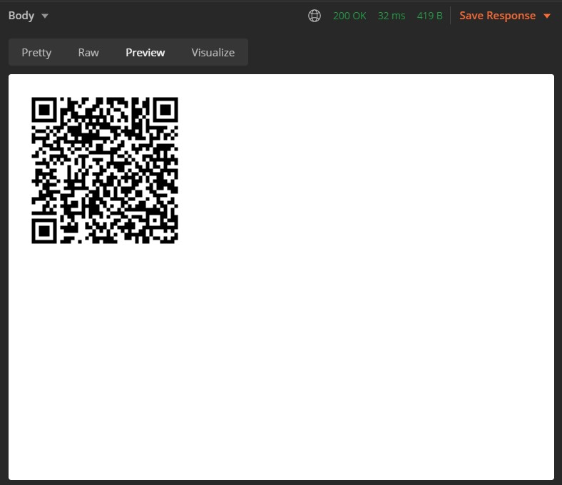

# GoogleAuthenticator-node-server

Node.js Server for 2FA google authenticator (TOTP)

## Setup

- Clone repo
- yarn/npm `install`
- Run script `serve` or `build` &gt; `start`
- Make requests using postman, postwomen, etc...

## Available routes

- ### `/generate-secert?numByte=32` (get)

  Create a random salt (secert) for qr generation and verification. Read more about secert length from [here][1]

  - `numByte` - number of byte of salt to generate

#### Reponse (string)

returns a randomly generated `secert` (save it securely)

- ### `/generate` (post)

  Create qr code for 2FA apps to scan

  #### Params (json)

  ```json
  {
    "label": "Example (user@email.com)",
    "salt": "**Salt**"
  }
  ```

  - **label** - Name to be appeared as title in 2fa apps
  - **salt** - Salt either generate by `/generate-secert` or your own

  #### Resonse (html)

  

- ### `/verify` (post)

  Verify otp generate by 2FA apps

  #### Params (json)

  ```json
  {
    "code": "123456",
    "salt": "**Salt**"
  }
  ```

  - **code** - otp generated by 2fa apps
  - **salt** - Same Salt that was used to generate the qrcode

  #### Resonse (json)

  ```jsonc
  {
    "isValid": true // or false,
    "message": "success" // or "invalid code"
  }
  ```

[1]: https://en.wikipedia.org/wiki/Google_Authenticator
